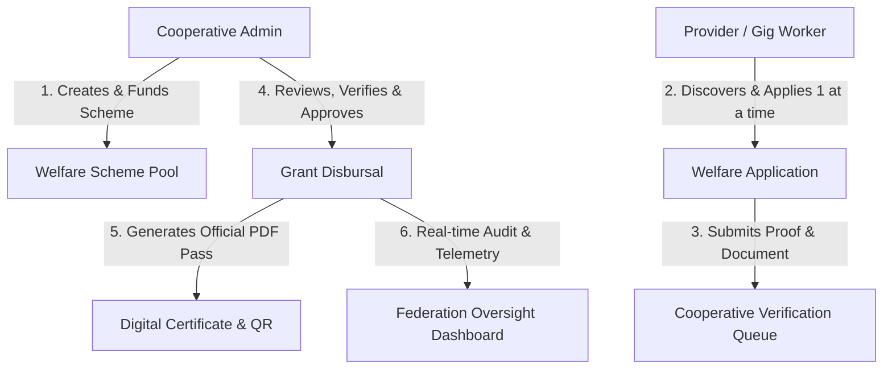
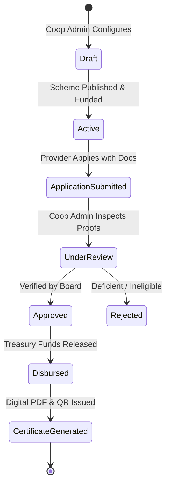

# 📜 PRD: SahakarGig Welfare & Social Security Management Framework
**Author:** Staff Principal Engineer & Systems Architect  
**Audience:** Cooperative Admins, Federation Governance, Providers (Gig Workers), Developers  
**Status:** Approved Architecture Draft  

---

## 1. Executive Summary & Vision

In the **SahakarGig Cooperative Gig Economy Platform**, gig workers (providers) are not merely algorithmic units; they are **verified member-owners** of their respective district cooperatives. 

Traditional platforms capture 25–35% commissions with zero safety nets. SahakarGig reverses this by mandating a **5% to 10% statutory Welfare Reserve Pool** from every completed service transaction. 

This document defines the end-to-end product architecture and operational requirements for the **Welfare & Schemes Management Engine**, replacing legacy static compliance logs with an active, automated, and auditable welfare creation, application, verification, and disbursement lifecycle.

---

## 2. Core Operational Entities & Roles



### The Three Stakeholders:
1. **Cooperative Admin (`Admin`)**:
   - Creates and manages bespoke welfare schemes (e.g. Tool Purchase Grants, Healthcare Support, Accidental Injury Compensation, Child Education Bursary).
   - Allocates fund budgets from the Cooperative's **Welfare Reserve Pool** (accrued via commission splits).
   - Reviews incoming member applications, verifies document attachments, and approves/rejects with audit notes.
   - Authorizes direct treasury disbursements.

2. **Worker / Provider (`Member Beneficiary`)**:
   - Discovers available welfare schemes created by their parent cooperative.
   - Enforces **"Single Active Claim Rule"**: A provider can have **only 1 active/pending welfare application** at any time to prevent double-dipping and ensure equitable distribution.
   - Uploads required documentary proofs (e-Shram card, medical bills, equipment purchase receipts, FIR/injury records).
   - Receives instant digital scheme certificates (printable/downloadable PDF with verifiable QR verification seal).

3. **Federation Governance (`Federation Admin`)**:
   - Real-time federation-level observability across all multi-state cooperatives.
   - Monitors:
     - Total welfare budget allocated vs disbursed across all societies.
     - Total active schemes per cooperative.
     - Number of approved beneficiaries and pending queue health.
     - Anomaly/fraud flags (e.g. over-disbursements, unverified claims).

---

## 3. Detailed Workflow & State Machine



### State Machine Rules:
1. **`Draft` / `Active` / `Paused` / `Depleted`**:
   - A scheme remains `Active` as long as its total allocated budget has not been exhausted.
   - When remaining budget hits 0, status automatically changes to `Depleted`.
2. **Provider Application Lifecycle**:
   - `submitted` ➔ `under_review` ➔ `approved` / `rejected` ➔ `disbursed`.
3. **Equitable Distribution Constraint**:
   - Database uniqueness index check: `ProviderId + Status: in ['submitted', 'under_review', 'approved_pending_payout']` must be strictly `<= 1`.

---

## 4. Key Functional Features

### 4.1 Scheme Creation & Treasury Management
* **Scheme Name, Category & Description**: Healthcare, Tool Subsidy, Emergency Relief, Education, Family Support.
* **Maximum Grant Amount**: Individual cap per member (e.g. ₹5,000 for Tool Subsidy, ₹25,000 for Medical Emergency).
* **Total Scheme Budget**: Max reserve allocation funded from society treasury.
* **Eligibility Criteria**: Minimum completed jobs count, minimum trust score (e.g. ≥ 4.0), active e-Shram linkage.
* **Required Documentation Checklist**: Specific proofs required from applicant (e.g. Doctor's Certificate, GST Equipment Bill).

### 4.2 Worker Application & Document Submission
* **Self-Service Application Portal**: Mobile-first UI allowing workers to view scheme terms, payout limits, and eligibility status.
* **Document Attachment Engine**: Upload invoices, medical proofs, or photo of damaged tools.
* **Live Status Tracking**: Real-time progress bar from submission to verification to disbursal.

### 4.3 Cooperative Review & Disbursal Tribunal
* **Verification Drawer**: Review attached documents with high-resolution preview.
* **Approval Modal**: Specify approved amount (can be partial or full grant up to cap).
* **Disbursement Engine**: Automatically debits the Cooperative's Welfare Reserve and records a transaction in the immutable ledger.

### 4.4 Verifiable Digital PDF Certificate & QR Seal
* **Official Cooperative Welfare Grant Certificate**:
  - Society Registration details, Registrar seal, Scheme Act provisions.
  - Member Name, e-Shram UAN, Grant Reference ID, Disbursed Amount.
  - Publicly scannable cryptographic QR verification URL (`/verify/welfare/:claimId`).
  - Single-click **"Download / Print Official PDF"** for the worker.

### 4.5 Federation Audit & Aggregate Monitoring
* **Cross-Cooperative Scheme Matrix**: Federation view showing active welfare pools in Karol Bagh, Mumbai, Bangalore, Kolkata, etc.
* **Welfare Utilization Index**: Metric calculating `% of retained commission redirected back to workers as social security`.

---

## 5. Technical Architecture & Database Schemas

### 5.1 New/Updated Schema: `server/src/models/WelfareScheme.js`
```javascript
const welfareSchemeSchema = new mongoose.Schema({
  cooperativeId: { type: mongoose.Schema.Types.ObjectId, ref: 'Cooperative', required: true },
  title: { type: String, required: true },
  category: { 
    type: String, 
    enum: ['medical', 'equipment', 'emergency', 'education', 'insurance', 'general'],
    required: true 
  },
  description: { type: String, required: true },
  maxAmountPerMember: { type: Number, required: true },
  totalBudget: { type: Number, required: true },
  utilizedBudget: { type: Number, default: 0 },
  requiredDocs: [{ type: String }], // e.g. ['eShram', 'Medical Invoice', 'Aadhaar']
  eligibility: {
    minCompletedJobs: { type: Number, default: 0 },
    minTrustScore: { type: Number, default: 0 },
    requireEshram: { type: Boolean, default: true }
  },
  status: { type: String, enum: ['active', 'paused', 'closed', 'depleted'], default: 'active' },
  startDate: { type: Date, default: Date.now },
  endDate: { type: Date }
}, { timestamps: true });
```

### 5.2 Schema: `server/src/models/WelfareClaim.js`
```javascript
const welfareClaimSchema = new mongoose.Schema({
  schemeId: { type: mongoose.Schema.Types.ObjectId, ref: 'WelfareScheme', required: true },
  cooperativeId: { type: mongoose.Schema.Types.ObjectId, ref: 'Cooperative', required: true },
  providerId: { type: mongoose.Schema.Types.ObjectId, ref: 'Provider', required: true },
  requestedAmount: { type: Number, required: true },
  approvedAmount: { type: Number, default: 0 },
  purposeDescription: { type: String, required: true },
  documentUrls: [{ type: String }],
  status: {
    type: String,
    enum: ['submitted', 'under_review', 'approved', 'rejected', 'disbursed'],
    default: 'submitted'
  },
  reviewedBy: { type: mongoose.Schema.Types.ObjectId, ref: 'User' },
  reviewNotes: { type: String },
  rejectionReason: { type: String },
  disbursedAt: { type: Date },
  transactionRef: { type: String }
}, { timestamps: true });

// Prevent duplicate active claims
welfareClaimSchema.index(
  { providerId: 1, status: 1 },
  { partialFilterExpression: { status: { $in: ['submitted', 'under_review'] } } }
);
```

---

## 6. UI & Navigation Restructuring

1. **Sidebar Navigation**:
   - Rename **"Compliance & Audit"** ➔ **"Welfare & Schemes"** (`/admin/welfare`) in [`AdminSidebar.jsx`](file:///e:/SahakarGig/client/src/components/AdminSidebar.jsx).
2. **Page Interface**:
   - Replace `/admin/compliance` with a full-featured **Welfare Management Console**:
     - **Top Metrics**: Total Welfare Reserve Pool, Active Schemes, Approved Grants, Pending Verification Queue.
     - **Tab 1: Active Society Schemes**: Scheme cards with remaining budget meters, eligibility badges, and "+ Launch New Scheme" modal.
     - **Tab 2: Member Claim Applications & Verification Queue**: Interactive table with document inspector, 1-click Approval & Disbursement modal, and rejection handler.
     - **Tab 3: Disbursal History & Printable Certificates**: View past claims, download official PDF certificate with QR code seal.
     - **Tab 4: Statutory Compliance & Registrar Returns**: Retain statutory audit return filings and e-Shram compliance metrics as a sub-tab.
3. **Federation View Integration**:
   - Expose cooperative welfare metrics to the Federation Analytics & Cooperative Detail consoles for multi-society governance.

---

## 7. Acceptance Criteria

- [x] Comprehensive PRD written and preserved in documentation.
- [ ] Cooperative Admin can launch a new scheme with category, budget, max grant, and eligibility rules.
- [ ] Provider claim submission strictly checks the "1 active claim" limit and validates attached proofs.
- [ ] Cooperative Admin can approve claims and trigger real-time treasury reserve deduction.
- [ ] Official PDF / Printable Certificate modal generates dynamically with scannable verification QR.
- [ ] Federation Admin dashboard displays real-time welfare transparency metrics across all cooperatives.
